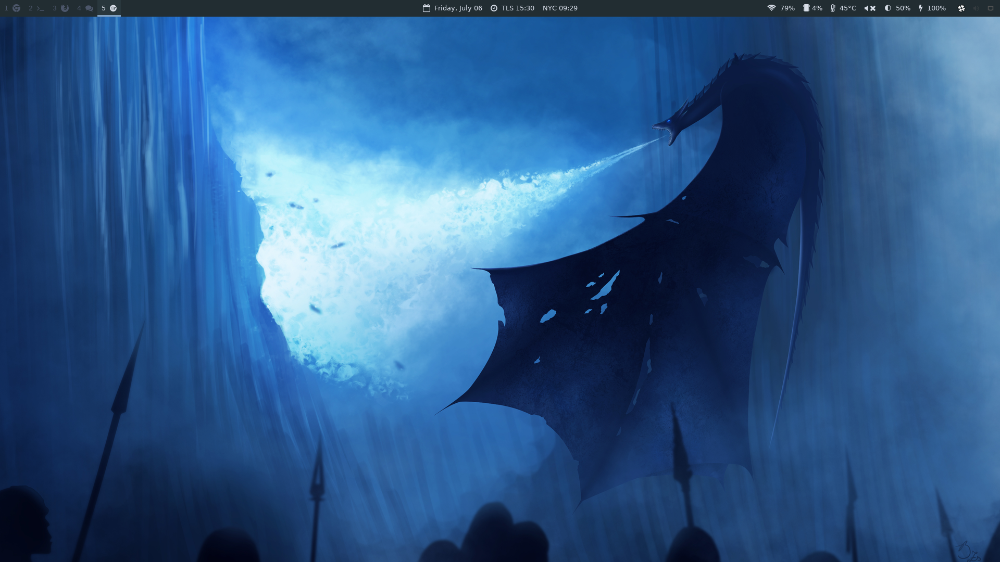
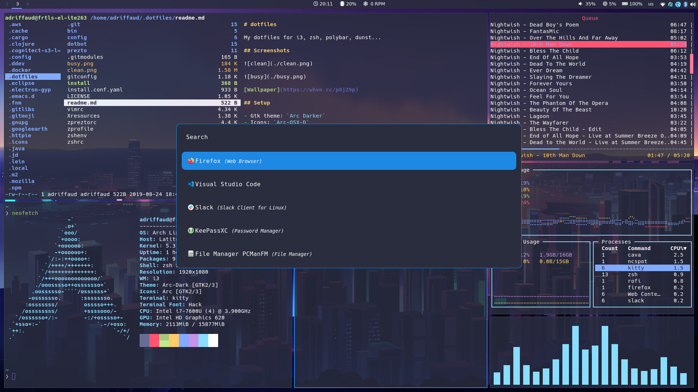

# dotfiles

My dotfiles for i3, zsh, polybar, dunst...

## Screenshots

[Wallpaper](https://whvn.cc/p8j29p)

## Setup

- Gtk theme: `Arc Darker`
- Icons: `Arc-OSX-D`
- Shell: `zsh`
- Terminal Emulator: `tilix`
- Text Editor: `vscode/spacemacs/vim`
- Theme: `Nord`
- Web Browser: `Mozilla Firefox`
- Window Manager: `i3wm`
- Linux Distribution: `Debian Linux Buster (testing)`

## Install

`git clone https://github.com/adriffaud/dotfiles .dotfiles && cd .dotfiles && ./install`
